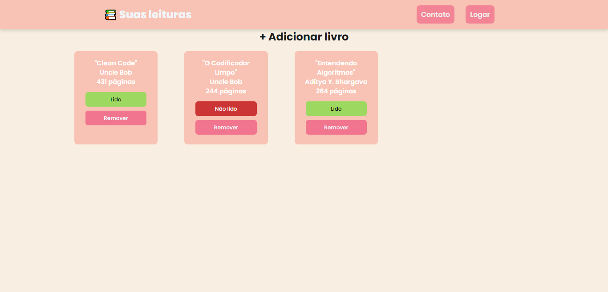
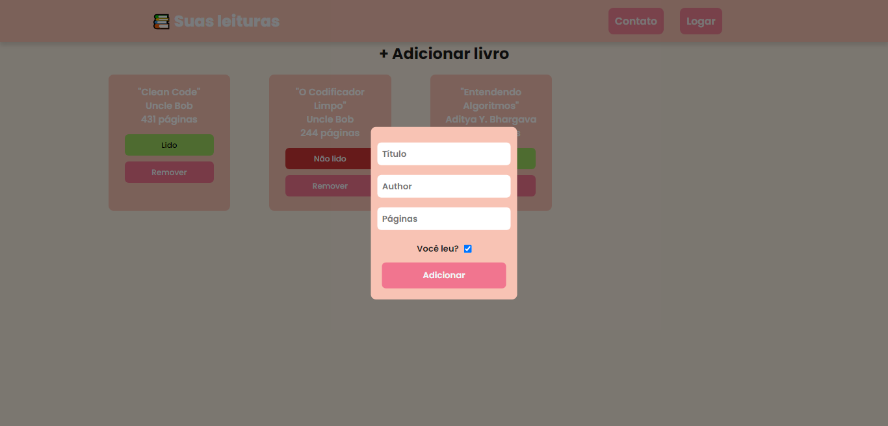

# 📚 Livraria suas leituras

 <a href="#-sobre">Sobre</a> •
 <a href="#-projeto">Projeto</a> •
 <a href="#%EF%B8%8F-autor">Autor</a>

## 💻 Sobre

O projeto consiste em um sistema de cadastro de leituras realizadas, no card contendo o título do livro, autor, número de páginas e se o mesmo já foi lido ou não, desenvolvido utilizando JavaScript, HTML e CSS. O sistema incorpora o uso de modais para melhorar a experiência do usuário.

<h3 align="center">
⚙️ Tecnologias utilizadas

&nbsp;

</h3>

---

## 🚧 Projeto

<h3 align="center">Página da sessão de livros lidos
  

  
  
</h3>

---

## ✒️ Autor

| [    Cherlau Prado ](https://github.com/cherPrado) |
| :--------------------------------------------------------------------------------------------------------------------------------------------: |

<h2 >Entre em contato 🤙🏽</h2>

